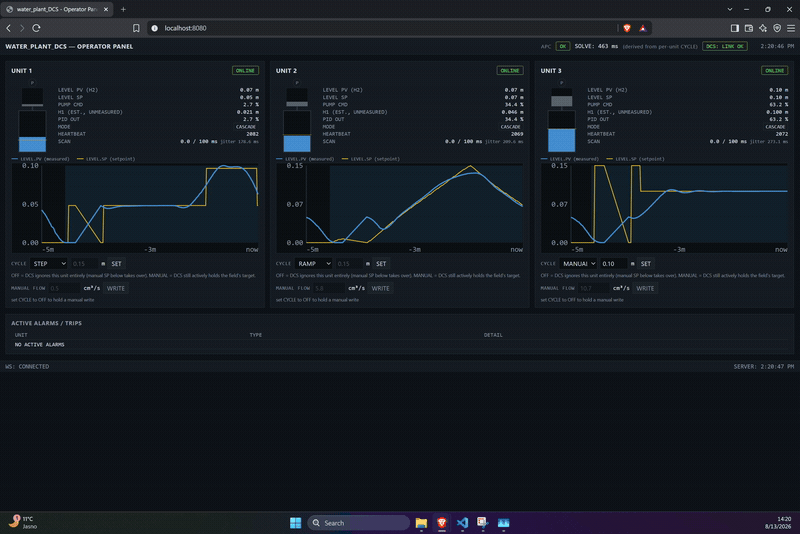

# water_plant_DCS

A simulated water treatment DCS/APC stack: PLC-level regulatory control, an
OPC UA supervisory MPC layer, and a browser-based operator panel, wired the
way these systems are actually structured in a real plant.

This is the industrial-control counterpart to the original Vodarna project
(a physical two-tank rig with a do-mpc controller). Here the same MPC core
is ported into a proper cascade architecture, communicating over OPC UA
with simulated PLC units instead of talking to hardware or a GUI thread
directly.

Each unit is a faithful copy of the original rig's physics: a pump fills
an upstream tank, which has no sensor (only an EKF estimate); the upstream
tank drains by gravity through a fixed orifice into a downstream tank,
which has the real sensor and is the level the cascade actually targets;
the downstream tank drains by its own fixed orifice to the sump. There is
no valve anywhere, one actuator only, matching the real rig exactly.

## The one rule that shapes everything else

**The MPC never touches an actuator. It writes setpoints.**

In a real plant, an APC layer sits above the DCS and writes a setpoint
into the regulatory control loop. It never reaches down and moves a valve
or a pump directly. That separation is what this project demonstrates:

```
MPC (dcs/)  --writes-->  PID.SP  --converted by-->  plc/ flow-to-command  -->  Pump.CMD  -->  pump
```

`PID.SP` is a **flow** setpoint (cm³/s), not a level: the MPC already
computes an optimal flow every solve (that's literally what it optimizes
for), so `dcs/` writes that number straight through instead of translating
it into a level point first. The PLC's own conversion from that flow to
`Pump.CMD` is a fixed, no-feedback calibration curve -- matching the
original rig exactly, which has no flow sensor either. See
[`dcs/README.md`](dcs/README.md#mapping-from-the-mpc-to-pidsp) for why an
earlier version of this project tried writing a level point instead and
what that cost.

If the DCS process crashes, dies, or gets disconnected, the PLC's own
watchdog notices the stale setpoint and forces flow to zero (fail-safe)
rather than continuing to pump on a stale command. The plant does not
silently keep doing whatever it was last told because a Windows box next
to it went down.

## Architecture

```
                         ┌─────────────────────────────┐
                         │   hmi/  (FastAPI, :8080)     │
                         │  mimic, trends, per-unit cycle │
                         └───────────────┬───────────────┘
                       OPC UA client (units)  │  OPC UA client (dcs)
                 ┌─────────────────────────────┼─────────────────────────────┐
                 │                             │                             │
                 ▼                             ▼                             │
   ┌─────────────────────────┐   ┌─────────────────────────┐                 │
   │  plc-1 (asyncua SERVER) │   │  plc-2, plc-3 ...        │                 │
   │  two-tank ODE + flow    │   │  same pattern            │                 │
   │  map + interlocks + HB  │   │                           │                │
   └────────────▲────────────┘   └────────────▲──────────────┘                │
                 │  OPC UA client (Level.PV, Status.Heartbeat)                │
                 │  OPC UA write (PID.SP flow setpoint, Level.SP target)     │
                 └─────────────────────────────┬───────────────────────────────
                                                │
                                   ┌────────────┴────────────┐
                                   │  dcs/  (asyncua CLIENT   │
                                   │  to units, SERVER of its │
                                   │  own for APC.* globals)  │
                                   │  nonlinear MPC + EKF     │
                                   │  per-unit heartbeat      │
                                   │  watchdog, SQLite log     │
                                   └───────────────────────────┘
```

Each PLC unit is its own OPC UA server (one process per tank). `dcs/` is an
OPC UA client to every unit and, at the same time, runs its own small OPC UA
server so the HMI (or any other client) can read `APC.SolveTime_ms` /
`APC.Status` and write `APC.Enabled` over the same protocol, without a
separate side channel. That same server also publishes a per-unit
`Diagnostics.H1_Estimated` node: the upstream tank's EKF-estimated level,
which the real rig never exposes either, since it has no sensor. `hmi/` is
a plain OPC UA client to both.

## Why the MPC actually matters here: preset setpoint cycles

A flat, unchanging target level is not where an MPC earns its keep over a
plain PID; that's the whole reason `dcs/` can hand a unit a real setpoint
*trajectory* instead, and get a controller that anticipates a change
before it happens rather than reacting after the fact. This is ported from
the original rig's own recipe-playback mechanism
(`load_cycle_to_mpc`/`tvp_fun` in `src/models/mpc_water_tank_controller.py`),
same CSV format, same two example profiles.

By default (`dcs/config.py`, no extra configuration needed):

- **Unit 1** tracks [`cycles/step_response.csv`](cycles/step_response.csv):
  flat, then a step. The MPC starts moving `PID.SP` (its commanded flow)
  ahead of the step because it previewed the upcoming level change across
  its solve horizon, not because the level already drifted off target.
  `Level.SP` (the DCS's actual level target, see below) itself steps
  instantly -- it is the flow the MPC produces to get there that ramps in
  early.
- **Unit 2** tracks [`cycles/ramp_response.csv`](cycles/ramp_response.csv):
  a ramp. `Level.SP` moves smoothly along it and `PID.SP` tracks whatever
  flow the MPC judges will follow that ramp.
- **Unit 3** holds a plain constant setpoint, the simple baseline.

That's just the seeded starting state, not a fixed assignment: each unit's
setpoint source (`off`/`step`/`ramp`/`manual`) is live-selectable
afterward from the HMI's per-unit CYCLE dropdown (visible in the
recording below), which switches `dcs/`'s active cycle for that unit on
the fly and bumplessly resets its phase -- see `dcs/README.md`'s
"Per-unit setpoint source" section for how.

See [`demos/demo_e_setpoint_cycles.py`](demos/demo_e_setpoint_cycles.py),
the demo this project is built to show, screen-recorded below at 2x speed:
Unit 1's flow ramping ahead of its step, Unit 2 tracking a ramp, Unit 3
holding a plain constant target.



## Contract-first build

The address space is frozen in [`tags.yaml`](tags.yaml) before any service
code exists. `plantbus/` turns that file into OPC UA server nodes
(`plantbus/server.py`) and client-side node resolution
(`plantbus/client.py`), so `plc/`, `dcs/`, and `hmi/` all build against the
same generated layout instead of hand-copying tag names. [`tools/fake_plc.py`](tools/fake_plc.py)
is a deliberately dumb OPC UA server that publishes the whole contract with
random-walk values, so `dcs/` and `hmi/` could be built and tested before
`plc/` existed.

[`reference/water_mpc/`](reference/water_mpc) holds the do-mpc + EKF
controller ported from the original Vodarna rig, unmodified in its model,
objective, constraints, and solver settings. `dcs/controller_wrapper.py`
adapts its interface to the cascade: the MPC's own optimal-flow output
(`MPCResult.flow_cm3s`) is clipped to the actuator's physical bounds and
written straight through as `PID.SP` (see
[`dcs/README.md`](dcs/README.md#mapping-from-the-mpc-to-pidsp) for why
that's a direct write rather than something derived from the predicted
level trajectory).

## Running it

```
docker compose up
```

Starts 3 PLC units, the DCS, and the HMI on one network. Open
`http://localhost:8080/` for the operator panel.

To run any single service standalone against `tools/fake_plc.py` instead of
the real `plc/`, see that service's own README:
[`plc/README.md`](plc/README.md), [`dcs/README.md`](dcs/README.md),
[`hmi/README.md`](hmi/README.md).

Scenario scripts are in [`demos/`](demos/README.md): an outflow disturbance
with APC on vs off, a killed unit degrading gracefully, a large setpoint
change against a level bound, scaling to 5 units, and the per-unit preset
setpoint cycles demo above.

## What v1 deliberately is not

These are conscious simplifications, not gaps hidden as complete:

- No real PLC runtime (no OpenPLC, no Codesys). Each unit is a plain Python
  process modeling a tank, a static flow-to-command conversion (`PID` in
  the tag/mode names is a naming holdover, not a closed loop -- see
  `plc/README.md`), and interlocks.
- No redundancy. One PLC process per unit, one DCS process, no failover.
- No OPC UA certificates or encryption. Anonymous auth, `NoSecurity` policy,
  same as most brownfield OT networks running behind a firewall rather than
  relying on the protocol layer for security.
- No OPC UA Alarms & Conditions. Alarms are plain boolean/string tags
  (`Interlock.Trip`, `Interlock.Reason`), polled by the HMI, not the A&C
  subsystem.
- No Modbus. OPC UA end to end.
- `docker compose up --scale plc=5` does not work out of the box with the
  current fixed 3-service compose file (every replica would claim the same
  `UNIT_ID`). See `OPEN_QUESTIONS.md` for what scale-friendly handling would
  need; `demos/demo_d_scale_to_5.py` demonstrates 5-unit scale-up against
  `tools/fake_plc.py`, which does not have this limitation.
- Only two demo cycle CSVs exist (`cycles/step_response.csv`,
  `cycles/ramp_response.csv`); there is no operator-facing recipe manager
  or file upload to add more. Which of the two (or `off`/`manual`) a unit
  starts on is seeded from a small config table in `dcs/config.py`,
  env-var overridable at DCS startup -- switching it live is an HMI/DCS
  feature (see above), not a `tags.yaml` one: `Control.CycleName` and
  `Control.ManualTargetM` deliberately live on the DCS's own ad hoc OPC UA
  server, not in the frozen PLC-facing contract.

`OPEN_QUESTIONS.md` has the complete list of contract gaps and integration
issues found while building this, including a couple of genuine bugs (an
OPC UA type mismatch in `tools/fake_plc.py`, a node-path mismatch between
`dcs/` and `hmi/` that only showed up once both were run together) and how
each was resolved.

## Repository layout

```
tags.yaml              frozen OPC UA address space contract
plantbus/               tags.yaml -> OPC UA server nodes / client subscriptions
tools/fake_plc.py       dumb OPC UA server for parallel development
reference/water_mpc/    ported do-mpc + EKF controller core
cycles/                 setpoint-cycle CSV loader + the two demo cycle files
plc/                    PLC unit simulator (two-tank ODE, flow-to-command conversion, interlocks, OPC UA server)
dcs/                    supervisory APC layer (MPC, watchdog, historian, OPC UA client+server)
hmi/                    operator panel (FastAPI + plain JS, OPC UA client)
demos/                  scenario scripts
docker-compose.yml      3 plc + 1 dcs + 1 hmi, one command to start everything
OPEN_QUESTIONS.md       contract gaps and integration issues found during the build
```
